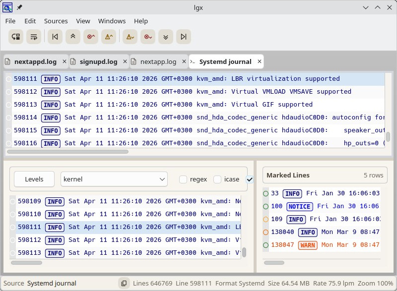

# LGX: High-Performance Multi-Source Log Viewer



## Vision & Goals

The goal of this project is to build a log viewer for Linux that is fast, easy to use, scalable, and capable of handling both log files and log streams. 

The application should feel closer to an IDE for logs than a traditional text viewer:

* Fast, responsive UI regardless of log size
* Work with multiple open logs
* Easy marking of log lines with multiple colors
* Flexible filtering views
* Direct support for log streams from Docker, Systemd, and Android (connected devices)
* Correct parsing and coloring for common log formats (not just naive keyword searches prone to false positives)

In short: a log viewer for serious developers and DevOps professionals.

I have used `glogg` as my log viewer of choice for a long time, but it is beginning to show its age. It also lacks built-in support for log streams. Viewing and analyzing logs is an important part of my daily work, so having the best tool available matters.

This is not the first log viewer I have created, but it is by far the best.

## Features

* Open multiple logs in tabs, like a web browser
* Open local files, pipe streams, Systemd journal, Docker container logs, and Android `logcat` streams
* Apply multiple filters to a single log source
* Separate pane for marked lines
* Treat streams like normal logs: follow, navigate, filter, and mark
* Auto-detect and colorize common log formats (generic text, Logfault-style, Logcat, Systemd)
* Per-source format override when auto-detection is insufficient
* Fast navigation (first/last line, ±10%, next/previous warning or error)
* Jump to an exact line number
* Optional follow mode for live logs
* Optional line wrapping
* Adjustable zoom (UI, mouse, keyboard)
* Selection-aware copy (single and multi-line)
* Per-line actions: mark/unmark, copy, expanded view
* Filter and marked views as horizontal or vertical splits
* Recent file and stream history
* Session-aware UI (wrapping, scanner selection, etc.)

## How it works

### Streams as files

Live sources (pipe commands, Docker logs, Android logcat, Systemd logs) are handled as stream providers.

They write incoming log events to a temporary file and reuse the same indexing, paging, and line-fetching pipeline as regular log-files.

This gives streamed logs the same behavior as file-backed logs.

### Fast initial scanning

The first pass over a source is optimized for startup speed.

Log scanners provide fast line-level classification so LGX can quickly build a lightweight index (offsets, line boundaries, log levels). This allows the UI to become usable quickly, even for very large files.

Scanners also support incremental updates. When a file grows or a stream appends data, LGX extends the existing state instead of rebuilding it.

### Memory-conscious paging and LRU cache

LGX does not keep full log contents in memory.

Instead, it stores metadata (page descriptors, line counts, indexing data), while actual text pages are stored in a shared LRU page cache.

* Active pages remain in memory
* Older, unused pages are evicted

This keeps large logs responsive without turning each open tab into a full in-memory copy.

## How to Use

### Opening logs

Use the menus to open sources:

* `File -> Open` — open a file
* `Sources -> Open Pipe Stream` — run a command (e.g. `journalctl -f`)
* `Sources -> Docker -> Open Running Containers`
* `Sources -> Logcat -> Open Devices`
* `File -> Recent` / `Sources -> Recent` — reopen previous sources

### Main view controls

The toolbar operates on the main tab:

* Toggle follow mode
* Toggle line wrapping
* Jump to first/last line
* Jump ±10%
* Jump to next/previous warning or error

The status bar shows:

* Source
* Line count
* Current line
* Format
* File size
* Ingestion rate
* Zoom level

Jump operations use the page cache, making them fast even on large logs.

### Menus and context menus

Useful menu paths:

* `View -> Follow -> Enabled`
* `View -> Log Lines -> Wrap long lines`
* `View -> Zoom`
* `View -> Format` (override scanner)
* `View -> Go to Line`
* `Windows -> Add Filter View`
* `Windows -> Add Marked View`

Context menu (log view):

* Right-click → `Copy Line`, `Copy Selection`, `Show`
* Long-press → expanded line view
* Gutter click → mark/unmark line. If you hold down keys 1–5, you get different colors for the mark.

### Keyboard and mouse shortcuts

* `f` — toggle follow mode
* `Ctrl+L` — go to line
* `Ctrl+F` — horizontal filter split
* `Ctrl+Shift+F` — vertical filter split
* `Ctrl+M` — horizontal marked split
* `Ctrl+Shift+M` — vertical marked split
* Arrow keys — scroll by line
* `PgUp` / `PgDown` — scroll by page
* `Left` / `Right` — horizontal scroll (when wrapping is off)
* `Ctrl+Left` / `Ctrl+Right` — jump to start/end of line
* `Ctrl + Mouse Wheel` — zoom
* Mouse wheel — scroll
* Scrollbars — manual navigation
* Double-click zoom value → reset to 100%

Behavior notes:

* Scrolling up disables follow mode
* Wrapping disables horizontal scrolling
* Copy works on the current selection

## Build from Source

LGX uses CMake, Qt 6, Boost headers, QCoro, and optionally `libsystemd` for the Systemd source.

### Debian / Ubuntu

```sh
sudo apt install \
  build-essential cmake ninja-build git pkg-config \
  qt6-base-dev qt6-declarative-dev qt6-svg-dev \
  libboost-dev libsystemd-dev
```

### Fedora

```sh
sudo dnf install \
  gcc-c++ cmake ninja-build git pkgconf-pkg-config \
  qt6-qtbase-devel qt6-qtdeclarative-devel qt6-qtsvg-devel \
  boost-devel systemd-devel
```

### Arch Linux

```sh
sudo pacman -S \
  base-devel cmake ninja git pkgconf \
  qt6-base qt6-declarative qt6-svg \
  boost systemd
```

### Build

```sh
cmake -S . -B build -G Ninja
cmake --build build
```

The application binary will be available as `build/bin/lgx`.

## Systemd

To access full system logs (not just your user logs), add your user to the appropriate group:

```sh
sudo usermod -aG systemd-journal $USER
```

Then log out and back in.

To disable the Systemd source at configure time:

```sh
cmake -S . -B build -G Ninja -DLGX_ENABLE_SYSTEMD_SOURCE=OFF
```

## Flatpak

The app is distributed for Linux as a *Flatpak*. Get the newest `.flatpak` bundle from the latest GitHub release.

### Install Flatpak

Install Flatpak with your distro package manager:

Debian/Ubuntu:

```sh
apt install flatpak
```

Fedora:

```sh
dnf install flatpak
```

openSUSE:

```sh
zypper install flatpak
```

Arch Linux:

```sh
pacman -S flatpak
```

Log out and back in if your desktop session does not immediately pick up Flatpak integration.

### Install LGX Flatpak

Download the release artifact, for example `lgx-v0.2.5.flatpak`, then install it for your user:

```sh
flatpak install --user ./lgx-v0.2.5.flatpak
```

On most distributions, it will be available from the start menu under `Development`. 
If you just installed the flatpak runtime, you might have to log out and back in.

You can also run it directly from the shell:

```sh
flatpak run eu.lastviking.lgx
```

To update to a newer downloaded bundle:

```sh
flatpak install --user ./lgx-v0.2.6.flatpak
```

## Status

**Beta**

## Blog posts about lgx

- [On lastviking.eu](https://lastviking.eu/tags/lgx.html)

*Add an issue if you want a link to your own blog post about lgx or related content*. 

